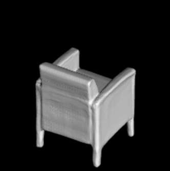
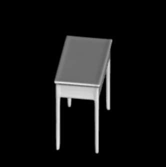

# MEGLN





This repository contains the code to reproduce the results from the paper
[Multi-scale Edge-guided Learning for 3D Reconstruction]().

You can find detailed usage instructions for training your own models and using pretrained models below.


## Installation
First you have to make sure that you have all dependencies in place.
The simplest way to do so, is to use [anaconda](https://www.anaconda.com/). 

You can create an anaconda environment called `mesh_funcspace` using
```
conda env create -f environment.yaml
conda activate mesh_funcspace
```

Next, compile the extension modules.
You can do this via
```
python setup.py build_ext --inplace
```

To compile the dmc extension, you have to have a cuda enabled device set up.
If you experience any errors, you can simply comment out the `dmc_*` dependencies in `setup.py`.
You should then also comment out the `dmc` imports in `im2mesh/config.py`.

## Demo


You can now test our code on the provided input images in the `demo` folder.
To this end, simply run
```
python generate.py configs/demo.yaml
```
You should download the pre-training model [MEGLN.pt](https://drive.google.com/file/d/16qxtbM47_bFxoFU2Jq-bqZIKpNiKHOyw/view?usp=sharing) before running this script.
This script should create a folder `demo/generation` where the output meshes are stored.
The script will copy the inputs into the `demo/generation/inputs` folder and creates the meshes in the `demo/generation/meshes` folder.
Moreover, the script creates a `demo/generation/vis` folder where both inputs and outputs are copied together.

## Dataset

To evaluate a pretrained model or train a new model from scratch, you have to obtain the dataset.
To this end, there are two options:

1. you can download our preprocessed data
2. you can download the ShapeNet dataset and run the preprocessing pipeline yourself

Take in mind that running the preprocessing pipeline yourself requires a substantial amount time and space on your hard drive.
Unless you want to apply our method to a new dataset, we therefore recommmend to use the first option.

### Preprocessed data
You can download our preprocessed data (73.4 GB) using

```
bash scripts/download_data.sh
```

This script should download and unpack the data automatically into the `data/ShapeNet` folder.

### Building the dataset
Alternatively, you can also preprocess the dataset yourself.
To this end, you have to follow the following steps:
* download the [ShapeNet dataset v1](https://www.shapenet.org/) and put into `data/external/ShapeNet`. 
* download the [renderings and voxelizations](http://3d-r2n2.stanford.edu/) from Choy et al. 2016 and unpack them in `data/external/Choy2016` 
* build our modified version of [mesh-fusion](https://github.com/davidstutz/mesh-fusion) by following the instructions in the `external/mesh-fusion` folder

You are now ready to build the dataset:
```
cd scripts
bash dataset_shapenet/build.sh
``` 

This command will build the dataset in `data/ShapeNet.build`.
To install the dataset, run
```
bash dataset_shapenet/install.sh
```

If everything worked out, this will copy the dataset into `data/ShapeNet`.

## Usage
When you have installed all binary dependencies and obtained the preprocessed data, you are ready to run our pretrained models and train new models from scratch.

### Generation
To generate meshes using a trained model, use
```
python generate.py CONFIG.yaml
```
where you replace `CONFIG.yaml` with the correct config file.

The easiest way is to use a pretrained model.
You can do this by using one of the config files
```
configs/img/onet_pretrained.yaml
configs/pointcloud/onet_pretrained.yaml
configs/voxels/onet_pretrained.yaml
configs/unconditional/onet_cars_pretrained.yaml
configs/unconditional/onet_airplanes_pretrained.yaml
configs/unconditional/onet_sofas_pretrained.yaml
configs/unconditional/onet_chairs_pretrained.yaml
```
which correspond to the experiments presented in the paper.
Our script will automatically download the model checkpoints and run the generation.
You can find the outputs in the `out/*/*/pretrained` folders.

Please note that the config files  `*_pretrained.yaml` are only for generation, not for training new models: when these configs are used for training, the model will be trained from scratch, but during inference our code will still use the pretrained model.

### Evaluation
For evaluation of the models, we provide two scripts: `eval.py` and `eval_meshes.py`.

The main evaluation script is `eval_meshes.py`.
You can run it using
```
python eval_meshes.py CONFIG.yaml
```
The script takes the meshes generated in the previous step and evaluates them using a standardized protocol.
The output will be written to `.pkl`/`.csv` files in the corresponding generation folder which can be processed using [pandas](https://pandas.pydata.org/).

For a quick evaluation, you can also run
```
python eval.py CONFIG.yaml
```
This script will run a fast method specific evaluation to obtain some basic quantities that can be easily computed without extracting the meshes.
This evaluation will also be conducted automatically on the validation set during training.

All results reported in the paper were obtained using the `eval_meshes.py` script.

### Training
Finally, to train a new network from scratch, run
```
python train.py CONFIG.yaml
```
where you replace `CONFIG.yaml` with the name of the configuration file you want to use.

You can monitor on <http://localhost:6006> the training process using [tensorboard](https://www.tensorflow.org/guide/summaries_and_tensorboard):
```
cd OUTPUT_DIR
tensorboard --logdir ./logs --port 6006
```
where you replace `OUTPUT_DIR` with the respective output directory.

For available training options, please take a look at `configs/default.yaml`.
